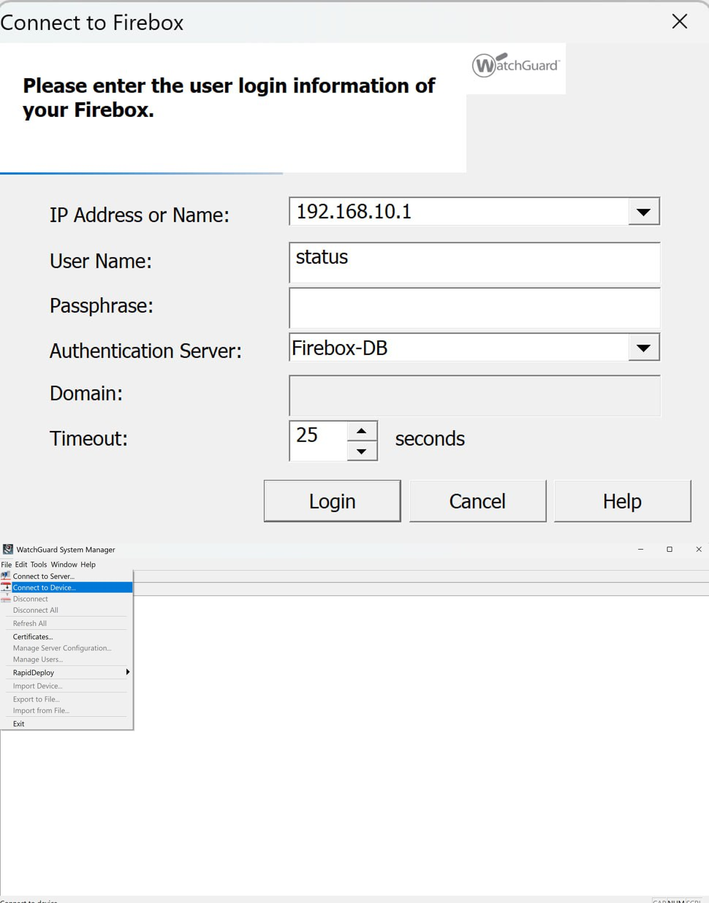

# Basic Installation und Initialkonfiguration der Firewall

Dieses Dokument beschreibt die grundlegende Installation und Erstkonfiguration
der WatchGuard Firewall im Rahmen des Projekts.

---

## Schritt 1: Physische Inbetriebnahme und Verbindung mit einem Client

Im ersten Schritt wird die Firewall physisch in Betrieb genommen
und für die Erstkonfiguration mit einem Client-System verbunden.

### Durchführung

- Die Firewall wird an die Stromversorgung angeschlossen und eingeschaltet.
- Ein Client-PC wird für die Erstkonfiguration vorbereitet.
- Der Client-PC wird entweder:
  - direkt über ein Netzwerkkabel mit einem LAN-Port der Firewall verbunden, oder
  - über einen Layer-2-Switch mit der Firewall verbunden.
- Es wird darauf geachtet, dass sich der Client-PC im selben Netzwerksegment
  wie das initiale Management-Interface der Firewall befindet.

Diese Verbindung dient ausschließlich der Erstkonfiguration und dem
Zugriff auf die Management-Oberfläche der Firewall.

## Schritt 2: Installation des WatchGuard System Managers

Nach der physischen Inbetriebnahme der Firewall wird im nächsten Schritt
die Management-Software **WatchGuard System Manager (Version 11.10.4)** 
auf einem Client-PC installiert.

### Zweck

Der WatchGuard System Manager wird benötigt, um:
- eine Verbindung zur Firewall herzustellen,
- die Erstkonfiguration durchzuführen,
- Interfaces, IP-Adressen und Regeln zu verwalten.

### Durchführung

- Die Installationsdatei des WatchGuard System Managers (Version 11.10.4) wird über folgende Webseite bezogen:

  👉 https://software.test.watchguard.com/SoftwareDownloads?current=true&familyId=a2RF00000009Gn9MAE

- Die passende Version für das eingesetzte Betriebssystem wird ausgewählt.
- Die Installation erfolgt gemäß dem Installationsassistenten.
- Nach erfolgreicher Installation wird der WatchGuard System Manager gestartet.

Anschließend wird über den WatchGuard System Manager eine Verbindung zur Firewall aufgebaut,
um die weitere Konfiguration vorzunehmen.

**Abbildung:** Aufbau der Verbindung zur Firewall über den WatchGuard System Manager

