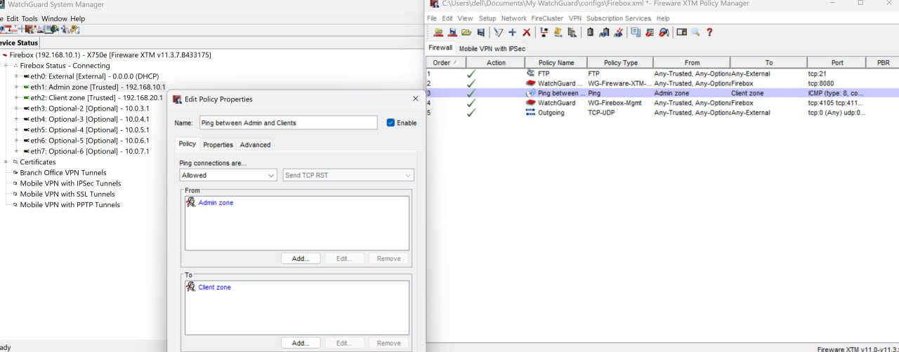
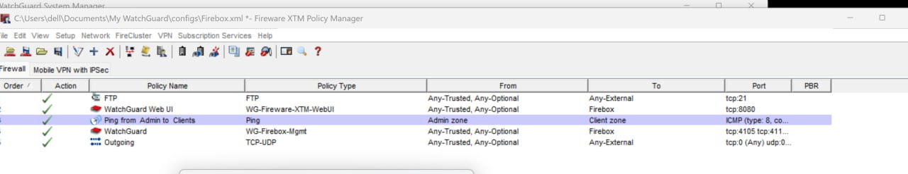
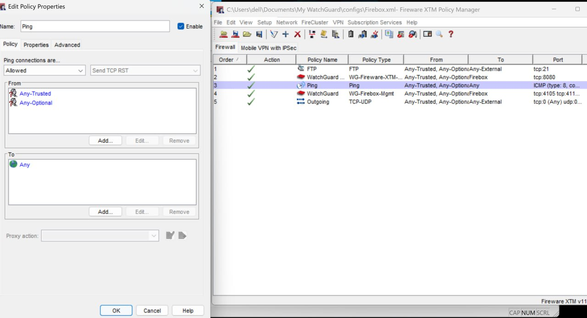

# Firewall Policies – Beispiele und Umsetzung

Dieses Dokument beschreibt beispielhafte Firewall-Regeln (Policies),
die im Rahmen des Projekts auf der WatchGuard Firewall umgesetzt wurden.
Ziel ist eine sichere Segmentierung der Netzwerke und eine kontrollierte Kommunikation
zwischen Admin-Netz, Client-Netz und Internet.

## Grundprinzip der Policy-Erstellung

Die Firewall-Regeln basieren auf dem **Least-Privilege-Prinzip**:
Es werden ausschließlich die Verbindungen erlaubt, die für den Betrieb notwendig sind.
Alle anderen Verbindungen sind standardmäßig blockiert.

