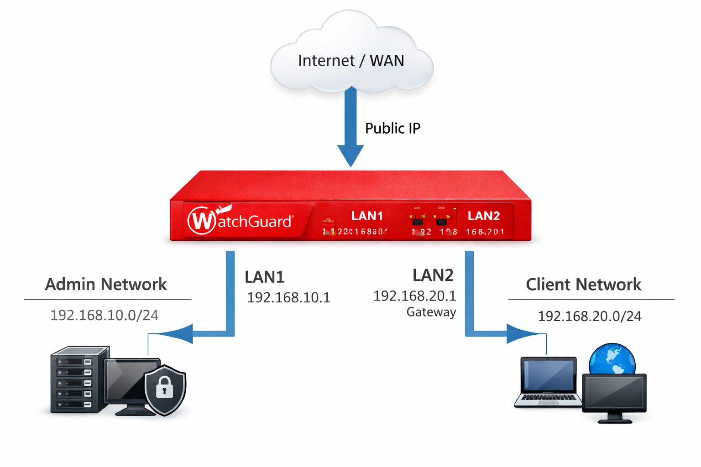

# Firewall – Technische Dokumentation (WatchGuard)

Dieses Dokument beschreibt die Einrichtung und Konfiguration der Firewall 

## 1. Netzwerkarchitektur

Die Firewall ist mit drei Interfaces konfiguriert:

- **WAN / Internet**
  - Verbindung zum externen Netzwerk
- **Client-Netz**
  - Netzwerk für Benutzer-Clients
- **Admin-Netz**
  - Separates Netzwerk für administrative Systeme

Jedes Interface befindet sich in einem eigenen Subnetz, um eine klare Trennung 
der Netzwerkzonen sicherzustellen.

## Netzwerk-Topologie

**Abbildung:** WatchGuard Firewall mit drei Interfaces  
- WAN (Internet)
- LAN1 – Admin-Netz (192.168.10.0/24, Gateway: 192.168.10.1)
- LAN2 – Client-Netz (192.168.20.0/24, Gateway: 192.168.20.1)

### 2. Kommunikation zwischen Admin- und Client-Netz

- **Admin-Netz → Client-Netz**
  - ICMP (Ping) erlaubt  
  - Zweck: Wartung, Troubleshooting und Administration

- **Client-Netz → Admin-Netz**
  - ICMP (Ping) nicht erlaubt  
  - Zweck: Schutz administrativer Systeme vor unautorisierten Zugriffen

## 3. Monitoring-Freigaben (ICMP / SNMP)

Für das Systemmonitoring mit PRTG wurden gezielt folgende Protokolle freigegeben:

- **ICMP**
  - Erreichbarkeitsprüfung (Ping)
- **SNMP**
  - Abfrage von System- und Statusinformationen

Diese Freigaben sind bewusst eingeschränkt und dienen ausschließlich 
Monitoring-Zwecken.

---

## 4. Sicherheitsaspekte und Einschränkungen

- Die eingesetzte Firewall basiert auf einer älteren Hardware-/Softwaregeneration
- Erweiterte Funktionen wie moderne Intrusion-Prevention-Systeme 
  stehen nur eingeschränkt oder nicht zur Verfügung
- Die Umgebung wird als **Laborumgebung** betrieben

Trotz dieser Einschränkungen stellt die Firewall eine grundlegende 
und wirksame Sicherheitsbarriere dar, insbesondere durch:

- Netzwerksegmentierung
- Strikte Zugriffskontrolle
- Reduktion unnötiger Kommunikationspfade

---
