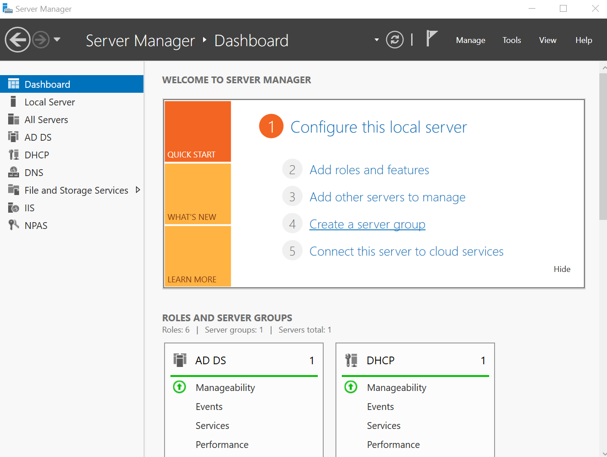
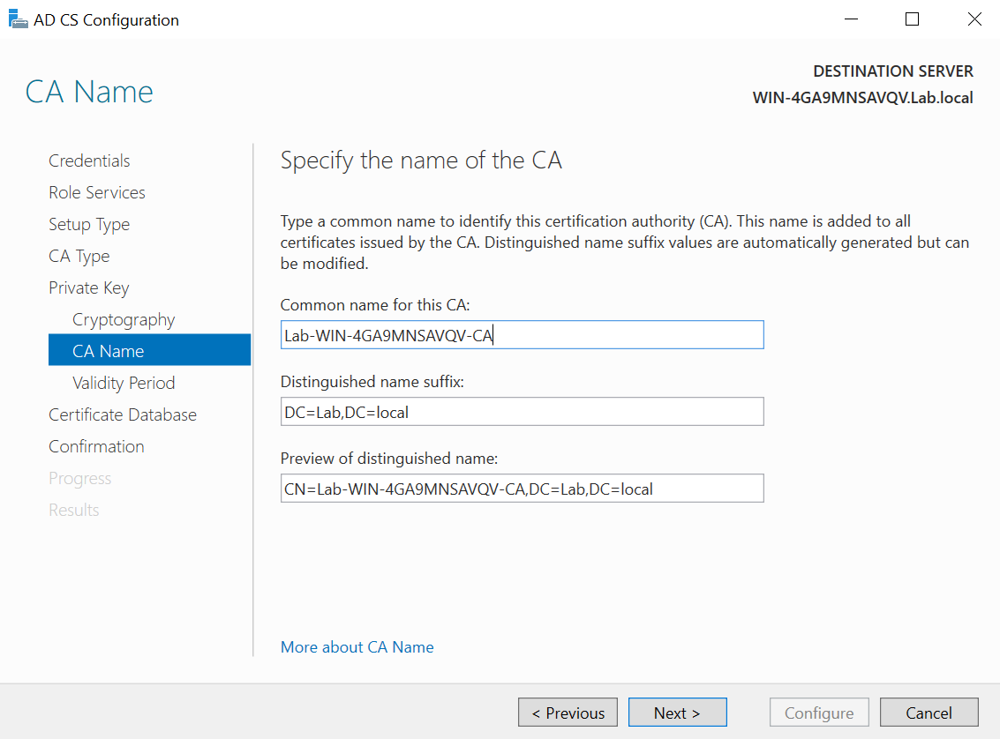
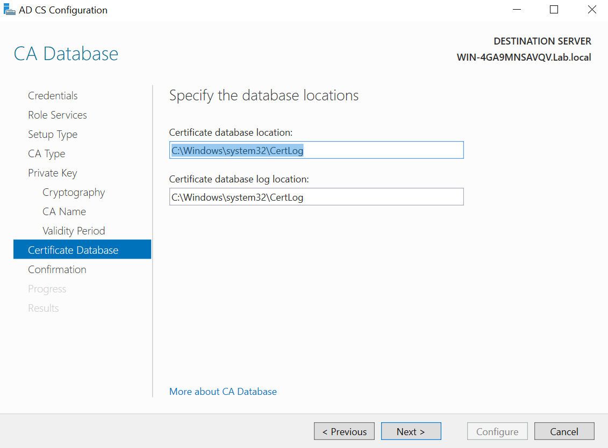
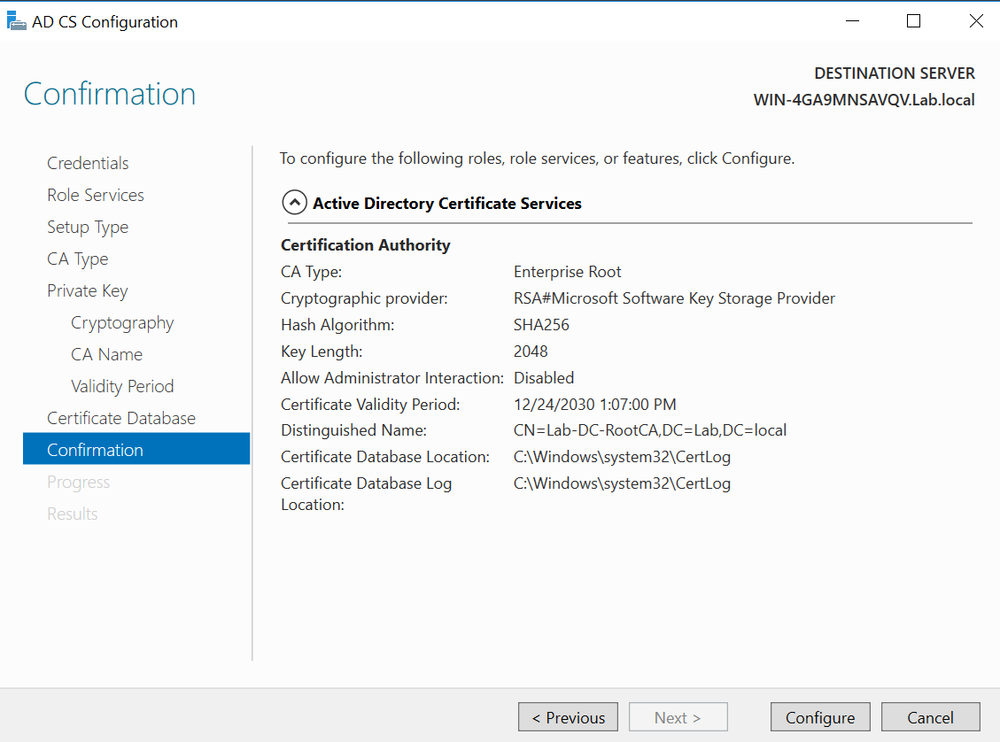
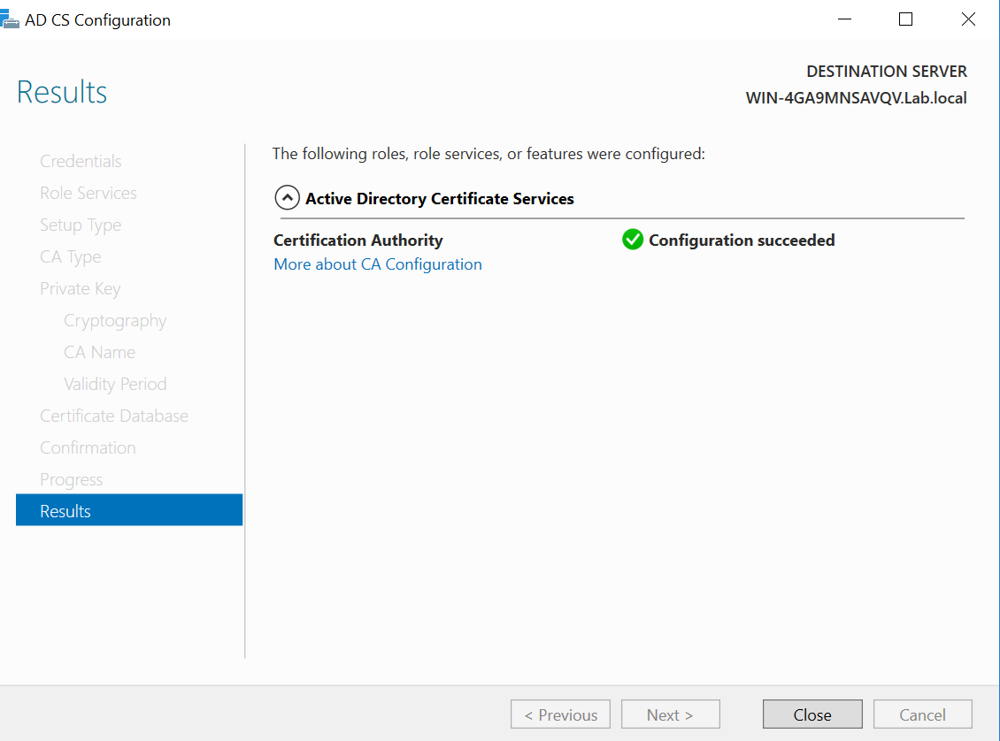

# CA-Installation (Microsoft AD CS)

Dieses Dokument beschreibt die Installation und Grundkonfiguration einer Microsoft Certificate Authority
in einer Active-Directory-Domäne.

## 1. Voraussetzungen
- Active Directory Domäne ist vorhanden und funktionsfähig
- Server für AD CS ist Mitglied der Domäne
- Administrative Berechtigungen vorhanden
- Namenskonzept für CA festgelegt (z. B. LAB-CA01)

## 2. Installation der Rolle
- Windows Server: **Server Manager** öffnen
- **Add roles and features**
- Rolle **Active Directory Certificate Services (AD CS)** auswählen
- Feature-Auswahl bestätigen und installieren

## 3. Konfiguration nach der Installation
- Im Server Manager: **Configure Active Directory Certificate Services**
- Rollenservices auswählen (typisch):
  - Certification Authority
  - (optional) Certification Authority Web Enrollment
- CA-Typ wählen:
  - **Enterprise CA** (empfohlen im AD-Kontext)
- CA-Variante:
  - **Root CA** (in Lab-Umgebungen üblich)
- Cryptography:
  - Key length (z. B. 2048/4096) und Hash (z. B. SHA256)
- CA-Name festlegen
- Gültigkeitsdauer definieren (lababhängig)
- Konfiguration abschließen

## 4. Ergebnis
Nach Abschluss steht eine funktionsfähige Enterprise CA zur Verfügung,
die Zertifikate an Domänenbenutzer/-computer ausstellen kann.

