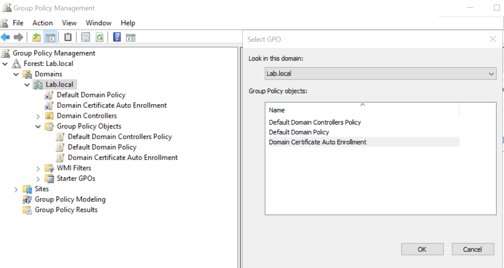
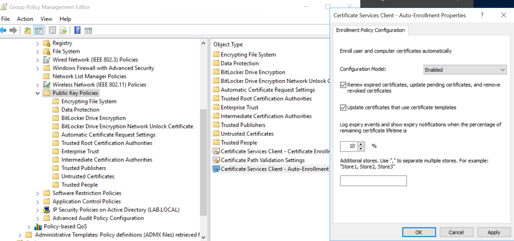
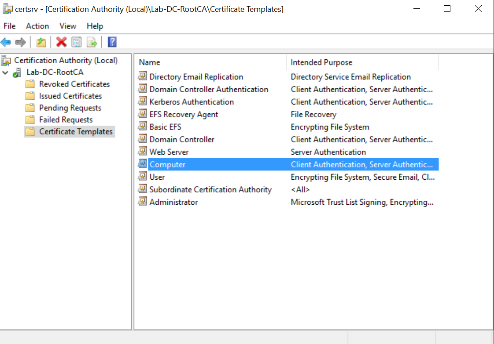
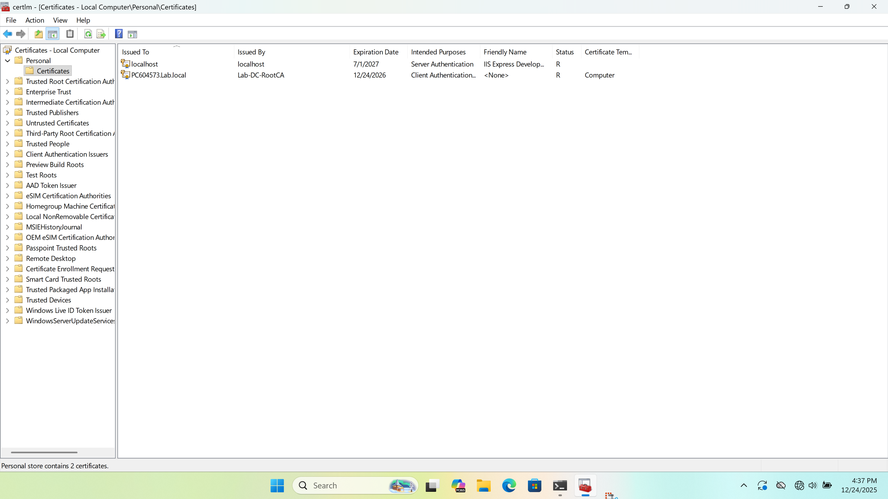
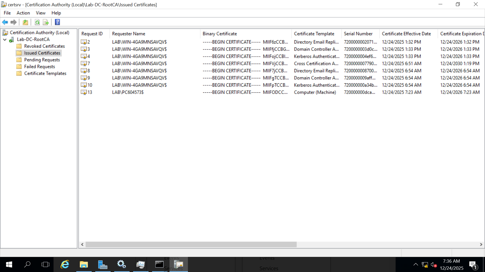

# GPO – Automatische Zertifikatsregistrierung (Auto-Enrollment)

Dieses Dokument beschreibt die Konfiguration einer Group Policy (GPO),
mit der Domänen-Computer automatisch Zertifikate von der Microsoft
Enterprise Certificate Authority beziehen.

Ziel ist es, Clients nach dem Domain-Join zur automatischen
Zertifikatsregistrierung zu befähigen bzw. zu verpflichten.

---

## Ziel der Konfiguration

- Domänen-Computer sollen automatisch ein Computerzertifikat erhalten
- Zertifikate sollen automatisch erneuert und aktualisiert werden
- Manuelle Zertifikatsanforderungen sollen vermieden werden

---

## Voraussetzungen

- Microsoft Enterprise CA ist installiert und funktionsfähig
- Geeignetes Zertifikat-Template (z. B. „Computer“) ist vorhanden
- Clients sind Mitglied der Active-Directory-Domäne
- Administrative Berechtigungen für GPO-Verwaltung

---

## Schritt 1: Erstellen einer neuen Group Policy

- **Group Policy Management** öffnen
- Neue GPO erstellen
- Name der GPO, z. B.:
  - `GPO-Certificate-AutoEnrollment`
- GPO mit der OU verknüpfen, in der sich die Client-Computer befinden

---

## Schritt 2: Konfiguration der Auto-Enrollment-Richtlinie

Die GPO wird im folgenden Pfad konfiguriert:

`Computer Configuration  
→ Policies  
→ Windows Settings  
→ Security Settings  
→ Public Key Policies`

- Richtlinie **Certificate Services Client – Auto-Enrollment** öffnen
- Status auf **Enabled** setzen
- Folgende Optionen aktivieren:
  - **Renew expired certificates, update pending certificates and remove revoked certificates**
  - **Update certificates that use certificate templates**

Diese Einstellungen sorgen dafür, dass Zertifikate automatisch
angefordert, erneuert und aktualisiert werden.

---

## Schritt 3: Konfiguration des Zertifikat-Templates

Damit Auto-Enrollment funktioniert, muss ein geeignetes Template
für Computer verfügbar sein.

### Vorgehen

- **Certificate Templates** Konsole öffnen
- Template **Computer** verwenden oder duplizieren
- Berechtigungen prüfen:
  - `Domain Computers`
    - **Enroll**
    - **Autoenroll**
- Template speichern

---

## Schritt 4: Veröffentlichen des Templates auf der CA

- **Certification Authority** Konsole öffnen
- Rechtsklick auf **Certificate Templates**
- **New → Certificate Template to Issue**
- Das konfigurierte Template auswählen und veröffentlichen

---

## Schritt 5: Aktualisierung der Clients

Auf einem Domänen-Client:

- Gruppenrichtlinien aktualisieren:

gpupdate /force

- Client neu starten (empfohlen)

---

## Schritt 6: Überprüfung der Zertifikatsregistrierung

Auf dem Client:

- `certlm.msc` öffnen
- Pfad: Personal → Certificates

## Ergebnis

Nach erfolgreicher Konfiguration erhalten Domänen-Clients automatisch
ein gültiges Computerzertifikat von der Enterprise Certificate Authority.
Die Zertifikate können nun für weitere sicherheitsrelevante Zwecke
verwendet werden (z. B. 802.1X, VPN, TLS).

Die folgenden Abbildungen zeigen exemplarisch die einzelnen Schritte
der GPO-Konfiguration.

### Abbildung 1: Erstellung der GPO

### Abbildung 2: Aktivierung der Auto-Enrollment-Richtlinie

### Abbildung 3: Zertifikat-Template – Berechtigungen

### Abbildung 4: Zertifikat auf dem Client

### Abbildung 5: Zertifikat auf dem Server

---

## Troubleshooting – Auto-Enrollment

In diesem Abschnitt werden typische Probleme beschrieben,
die bei der automatischen Zertifikatsregistrierung (Auto-Enrollment)
auftreten können, sowie mögliche Ursachen und Lösungsansätze.

---

### Problem 1: Client erhält kein Zertifikat

**Beschreibung:**  
Ein Domänen-Client erhält nach der Anmeldung oder nach `gpupdate /force`
kein Computerzertifikat von der CA.

**Mögliche Ursachen:**
- Die GPO ist nicht korrekt mit der OU der Client-Computer verknüpft
- Die GPO wurde noch nicht angewendet
- Auto-Enrollment ist in der GPO nicht aktiviert
- Der Client hat noch keine Verbindung zur CA

**Lösungsansätze:**
- Überprüfen, ob die GPO mit der richtigen OU verknüpft ist
- Auf dem Client `gpresult /r` ausführen und prüfen, ob die GPO angewendet wird
- Gruppenrichtlinien mit `gpupdate /force` aktualisieren
- Client neu starten

---

### Problem 2: Zertifikat-Template wird nicht ausgestellt

**Beschreibung:**  
Der Client versucht ein Zertifikat anzufordern, erhält jedoch keins.

**Mögliche Ursachen:**
- Das Zertifikat-Template ist nicht auf der CA veröffentlicht
- Das falsche Template wird verwendet
- Berechtigungen für das Template sind nicht korrekt gesetzt

**Lösungsansätze:**
- In der Certification Authority Konsole prüfen, ob das Template veröffentlicht ist
- Sicherstellen, dass das Template für Computer vorgesehen ist
- Berechtigungen prüfen:
  - `Domain Computers` müssen **Enroll** und **Autoenroll** besitzen

---

### Problem 3: Zugriff auf die CA nicht möglich

**Beschreibung:**  
Der Client kann keine Verbindung zur CA herstellen.

**Mögliche Ursachen:**
- DNS-Auflösung der CA funktioniert nicht
- Netzwerkverbindung zur CA ist gestört
- Firewall blockiert notwendige Verbindungen

**Lösungsansätze:**
- DNS-Auflösung der CA prüfen (`nslookup`)
- Netzwerkverbindung testen (Ping / Port-Erreichbarkeit)
- Firewall-Regeln überprüfen

---

### Problem 4: Zertifikat ist vorhanden, aber nicht gültig

**Beschreibung:**  
Ein Zertifikat ist auf dem Client vorhanden, wird jedoch als ungültig angezeigt.

**Mögliche Ursachen:**
- CA-Zertifikat ist nicht vertrauenswürdig
- Systemzeit von Client und CA weicht stark voneinander ab
- Zertifikat ist abgelaufen oder widerrufen

**Lösungsansätze:**
- Prüfen, ob das Root-CA-Zertifikat im Trusted Root Store vorhanden ist
- Systemzeit synchronisieren (z. B. über Domänenzeit)
- Zertifikatsstatus in der CA prüfen

---

### Hinweis

Troubleshooting ist ein fortlaufender Prozess.
In produktiven Umgebungen sollten Logs regelmäßig ausgewertet
und Auto-Enrollment-Prozesse überwacht werden.

