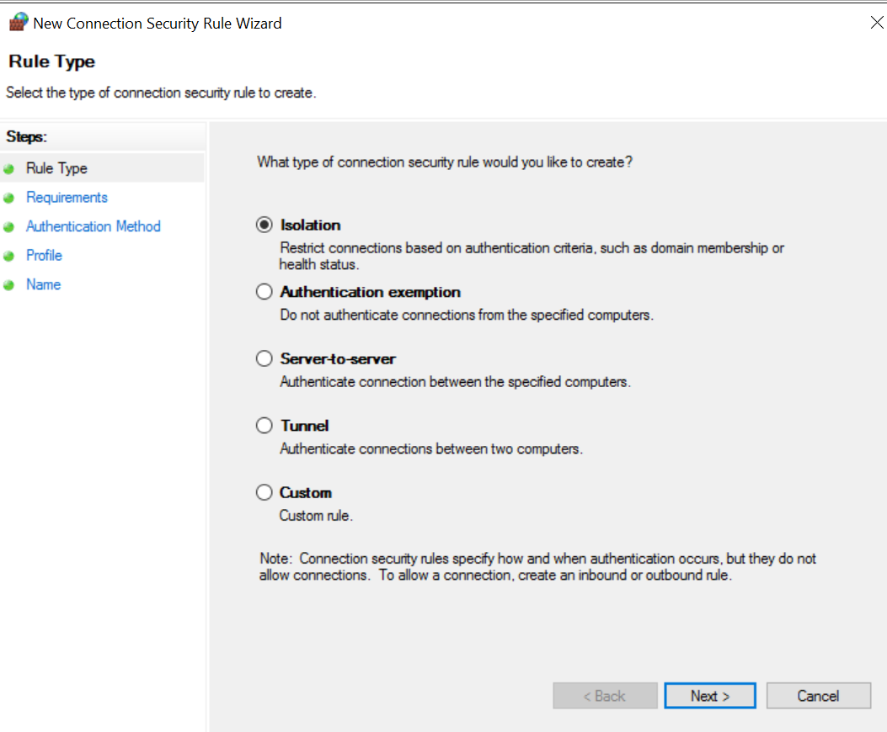
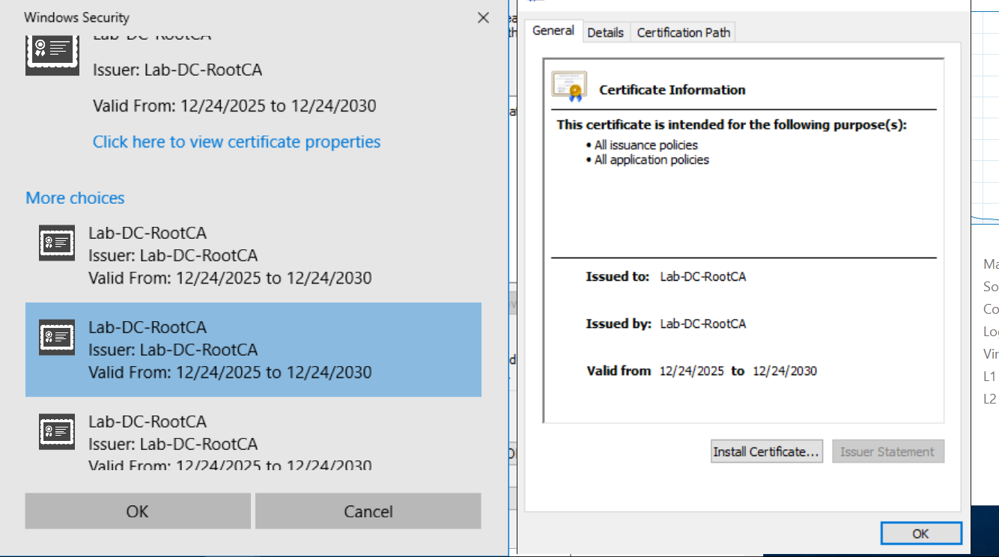

# Einsatzszenarien für Zertifikate (Use Cases)

Dieses Dokument beschreibt beispielhafte Einsatzszenarien
für die im Projekt ausgestellten Zertifikate.
Die Zertifikate werden über eine Microsoft Enterprise CA
bereitgestellt und automatisch über Group Policies (Auto-Enrollment)
an Domänen-Clients verteilt.

---

## Überblick

Durch die Nutzung von Zertifikaten können sicherheitsrelevante
Funktionen umgesetzt werden, die über klassische Benutzername/Passwort-
Authentifizierung hinausgehen.

---

## Use Case 1: Domain Isolation (IPsec mit Zertifikaten)

**Beschreibung:**  
Domain Isolation dient dazu, die Kommunikation innerhalb eines Netzwerks
auf Domänenmitglieder zu beschränken.
Nur Systeme, die Mitglied der Active-Directory-Domäne sind und über
ein gültiges Zertifikat verfügen, dürfen miteinander kommunizieren.

**Nutzen:**
- Schutz vor nicht autorisierten oder fremden Systemen im Netzwerk
- Erhöhte Sicherheit durch gegenseitige Authentifizierung
- Reduzierung von Angriffsmöglichkeiten innerhalb des internen Netzes

**Technische Grundlage:**
- IPsec-Richtlinien
- Zertifikatsbasierte Authentifizierung
- Automatisch ausgestellte Computerzertifikate (Auto-Enrollment)

**Typische Umsetzung:**
- Definition von IPsec-Regeln über Group Policies
- Erzwingen der Authentifizierung mit Computerzertifikaten
- Blockieren von ungeschützter Kommunikation

---

## Use Case 2: Zertifikatsbasierte Client-Authentifizierung

**Beschreibung:**  
Computerzertifikate ermöglichen eine eindeutige Identifikation von Clients
innerhalb der Domäne.

**Einsatzmöglichkeiten:**
- Authentifizierung bei Netzwerkzugriffen
- Vertrauenswürdige Geräteidentität
- Grundlage für Zero-Trust-ähnliche Konzepte

---

## Use Case 3: Absicherung interner Dienste (TLS / HTTPS)

**Beschreibung:**  
Interne Webdienste und Management-Oberflächen können mithilfe
von Zertifikaten abgesichert werden.

**Beispiele:**
- HTTPS für interne Webanwendungen
- Verschlüsselte Kommunikation zu Management-Interfaces
- Vertrauenswürdige TLS-Verbindungen innerhalb der Domäne

---

## Use Case 4: VPN mit Zertifikaten (optional / zukünftig)

**Beschreibung:**  
Zertifikate können zur Authentifizierung von Clients bei VPN-Verbindungen
verwendet werden.

**Vorteile:**
- Keine ausschließliche Passwort-Authentifizierung
- Erhöhte Sicherheit durch Gerätebindung
- Reduzierung von Phishing-Risiken

---

## Use Case 5: Grundlage für weitere Sicherheitskonzepte

**Beschreibung:**  
Die implementierte PKI-Struktur bildet eine Basis für weitere
sicherheitsrelevante Erweiterungen.

**Beispiele:**
- 802.1X (LAN/WLAN)
- Mutual TLS (mTLS)
- Erweiterte Netzwerksegmentierung

---

## Screenshots – Domain Isolation (Beispiel)

Die folgenden Abbildungen zeigen exemplarisch die Umsetzung
der Domain Isolation mittels IPsec und Zertifikaten.

### Abbildung 1: IPsec-GPO – Übersicht

### Abbildung 2: IPsec-Regeln mit Zertifikaten

### Abbildung 3: Erfolgreiche geschützte Kommunikation

---

## Zusammenfassung

Die dargestellten Use Cases zeigen, wie Zertifikate
als zentrales Sicherheitselement in einer Active-Directory-Umgebung
eingesetzt werden können.
Insbesondere Domain Isolation stellt einen effektiven Mechanismus dar,
um interne Netzwerke vor unautorisierten Systemen zu schützen.

